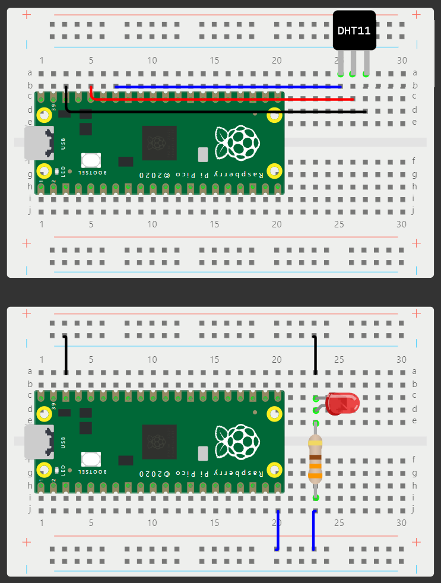

# Pico

## Development

**IMPORTANT** -- All commands are executed from the root directory of the project.

```bash
touch src/config.py
```

Copy the following content into the file and update the values with correct credentials:

```py
# src/config.py
#
# ******************** IMPORTANT! ********************
# *** This file should never be version controlled ***
# ****************************************************

# WiFi
SSID = ""
SSID_SECRET = ""

# Adafruit IO
ADA_USER = ""
ADA_SECRET = ""

## MQTT
HOST = "io.adafruit.com"
PORT = 1883
```

> See **[BROKER.md](BROKER.md)** for setting up a local MQTT broker.
>
> **NOTE**: This flow is not included in the primary guide.

## Guide and Walkthrough

Temperature Alarm System

Author: [Samuel Svensson](https://github.com/samme90s)

### Objective

The objective of this project is to build a sensor for fridges that alerts the user if the temperature is outside its correct range of 2-8°C. Two MCUs will be connected to the internet and one will transmit data to a cloud service whilst the other subscribes to this data and analyzes it. Additionally, the project will give insights into the possibilities of internet of things and how to apply code to real world applications. Based on the data collected, the user can see trends over time, make decisions based on the data and present the data in a meaningful way, and apply a solution to prevent a possible problem.

### Material

All the material can be picked up at Elektro:Kit (Sweden). Here are the minimum articles required (picking up a breadboard is recommended). Depending on the version of DHT11, a resistor might be needed (the one listed below does not when using the 3v3 onboard pin). A second Pico is optional as you could technically use the same Pico to attach the LED to. However, this does not allow for the same functionality and flexibility, i.e. it would have to be in the same location as the sensor.

| Type                       | Article                                                                        | Price  |
| -------------------------- | ------------------------------------------------------------------------------ | ------ |
| MCU (PicoWH)               | [41019114](https://www.electrokit.com/raspberry-pi-pico-wh)                    | ~90SEK |
| Temperature sensor (DHT11) | [41015728](https://www.electrokit.com/digital-temperatur-och-fuktsensor-dht11) | ~50SEK |
| LED (Red)                  | [40307020](https://www.electrokit.com/led-5mm-rod-diffus-1500mcd)              | ~5SEK  |
| Resistor (330ohm)          | [40810233](https://www.electrokit.com/motstand-kolfilm-0.25w-330ohm-330r)      | ~1SEK  |
| Breadboard                 | [41012199](https://www.electrokit.com/kopplingsdack-400-anslutningar)          | ~50SEK |
| \*Wires (Female-to-Female) | [41015695](https://www.electrokit.com/labsladd-1-pin-hona-hona-150mm-10-pack)  | ~30SEK |
| \*Wires (Male-to-Male)     | [41015693](https://www.electrokit.com/labsladd-1-pin-hane-hane-150mm-10-pack)  | ~30SEK |

**\*** Recommended to get both, but you decide which you need.

### Software and tools

[Python](https://www.python.org/downloads/)

#### Flashing

1. Flash the microcontroller with MicroPython. The firmware can be downloaded from the official website. Ensure that the device corresponds correctly to the driver (in our case: [MicroPython-PicoW](https://micropython.org/download/RPI_PICO_W/))
2. Hold the **BOOTSEL** button on the Pico whilst connecting it to the computer.
3. Unzip the downloaded file and move it on to the device.
4. Wait a few seconds and then reconnect the device (**NOT** holding the **BOOTSEL** button).

#### IDE

**Visual Studio Code** for its modularity and ease of use. I recommend using either one of these extensions: [MicroPico](https://marketplace.visualstudio.com/items?itemName=paulober.pico-w-go) or [Pymakr](https://marketplace.visualstudio.com/items?itemName=pycom.Pymakr).

**Thonny** is also a good alternative, though it lacks a lot that VSCode offers (however sometimes this solution can be more simple if trying to debug and see what files are on the device).

### Construction

**IMPORTANT** -- Make sure to not confuse `Pin` numbers with `GPIO` numbers and the Pico has both.
The `GPIO` numbers are the ones used in the code and will therefore be used in this tutorial. See respective diagrams: [PicoW](https://www.raspberrypi.com/documentation/microcontrollers/raspberry-pi-pico.html#pinout-and-design-files-2) and [DHT11](https://www.electrokit.com/upload/product/41015/41015728/41015728_-_Digital_Temperature_Humidity_Sensor.pdf).



### Adafruit IO

Adafruit IO is a cloud service that allows you to send and receive data from your devices. It is easy to use and has a free tier that is sufficient for this project.

1. Create an account at [Adafruit IO](https://io.adafruit.com/).
2. Enter your credentials in the `config.py` file (see [Development](#development) above).

Feeds are the data points and stores the data sent from the device and represent the MQTT topics. Furthermore, creating a dashboard allows the user to control a feed or display its data.

### Data flow / Connectivity

Both devices are connected to the internet via the WiFi protocol (utilizing the MicroPython network library) and runs on a ~1 second interval. However, the temperature data is only sent every ~30 seconds to prevent rate limiting by the cloud service. This protocol suffices as the device is stationary and does not require a long range. Furthermore, the project does not use a LoRa-WAN component.

### Information Transport

The data is sent through MQTT (Message Queuing Telemetry Transport) which is a lightweight messaging protocol. This is done utilizing the [umqtt.simple](https://github.com/micropython/micropython-lib/blob/master/micropython/umqtt.simple/umqtt/simple.py) module. This protocol suited the project and is commonly used in IoT applications. It offers the subscribe and publish functionality that is needed, whilst being lightweight and easy to use.

Due to the nature of MQTT topics are used. The topics are defined to comply with Adafruit.io standards (see [Adafruit IO](#adafruit-io) above). The data sent to these topics is a byte string, either representing the state of the LED or the sensor readings.

### Code

The code is already well defined and self explanatory. However, here are some key points, including the structure of the project.

```plaintext
.
├── src
│   ├── alert_device
│   │   ├── boot.py     (Main file)
│   ├── sensor_device
│   │   ├── boot.py     (Main file)
│   ├── config.py       (Configurations and credentials)
│   ├── umqttsimple.py  (MQTT module)
│   └── scripts.py      (Controllers, strategies and services)
```

```py
# Since normal Python does not work on the Pico, we need to import the MicroPython
# modules and allows us to control the hardware. The ones below are just a few examples
# of what is available. Make note of the distinction of the modules and the standard Python ones.

import machine
import ubinascii
import utime
```

```py
# src/scripts.py
#
# Mainly contains the controllers for different components and services that is
# then used in respective boot or main file.
#
# Also offers a strategy for implementing a callback for the subscribe method
# found in the MQTT controller.

def abstractmethod(f):
    return f


class CallbackStrategy:
    @abstractmethod
    def execute(self, topic: bytes, msg: bytes):
        pass


class Controller:
    def __init__(self, name="CTRL"):
        """
        The name is used for debugging purposes
        and is added to the log whenever a message is printed.
        """
        self.name = name

        self._print("Initializing")

    def _print(self, msg: str):
        """
        Utilizes the name from the constructor and takes a message.
        """
        print(f"{self.name} :: {msg}")

    def _handle_exc(self, exc: Exception):
        """
        Handles exceptions and prints them to the console.
        The device is then reset after a second.
        """
        self._print(f"{str(exc.__class__.__name__)}<{str(exc)}>")
        utime.sleep(1)

        self._print("MACHINE<Resetting>")
        utime.sleep(1)

        machine.reset()


class WIFI(Controller):
    ...


class MQTT(Controller):
    ...

    def subscribe(self, topic: bytes, callback: CallbackStrategy):
        ...

    ...


class DHT(Controller):
    ...
```

### Presentation and Reflections

[Video Presentation](#)

I originally wanted to create a weather station and possibly using machine learning to predict the weather. However, I found that it may be too expensive with the components. I then tried looking at something more simple and allowed me to use existing components that I already had. I instead decided to go for an application that allowed me to monitor temperature and alert the user if it goes outside its range. Therefore creating it specifically for a fridge seemed like a good idea and could be useful in a real world scenario.

Due to the simplicity of the project I also looked at setting up my own MQTT broker (similar to Adafruit IO). I did it and it worked without much trouble (utilizing docker). The authentication part was not very secure and would take some time to configure using existing plugins. I found that an already functioning service was more suitable and allowed me to focus on the important parts. It was easier to set up and use, thus reducing the complexity and failure points. However, it was a good learning experience and I am happy I did it. A guide will be included but is not used primarily.

Using 3D printing and encasing the hardware would allow for a more serious approach to actually utilizing the sensor in a real world scenario. My presentation only illustrates the potential and could be done more seriously. I do not plan on keeping this solution and therefore won't invest in a permanent build.

Most modern fridges have alarms that alert the user if the temperature is outside its correct range. However, this project could still be useful for older ones. It also allows for the user to see trends which can act as a debugging tool if the fridge is not working as intended. Possibly following climate changes such as heatwaves and other events that could affect its performance.
